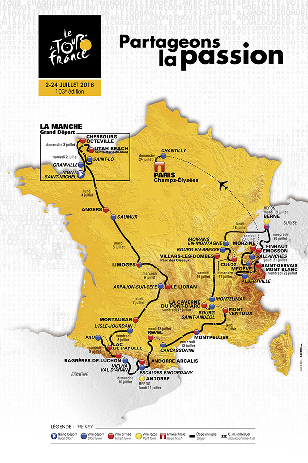
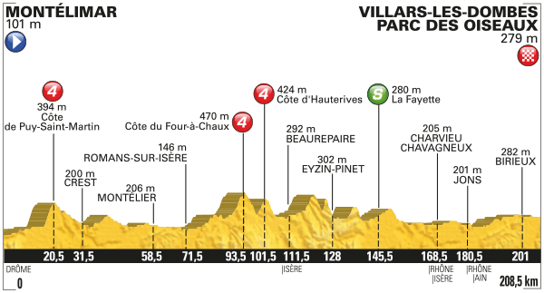
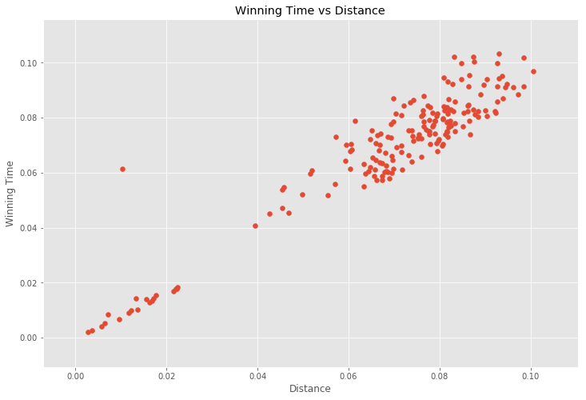
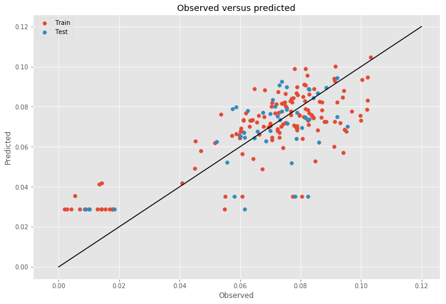

For my second project at Metis I set out to predict winning stage times for the Tour de France. For those unfamiliar with the Tour it is the _premier_ cycling competition in the world, although some may disagree. It's one of the four cycling grand tours and the most well-known cycling race in the United States. The Tour takes place each July and consists of 21 individual races called stages. Each stage has an individual winner and the overall winner is the rider with the lowest cumulative time after all the stages.

Rather than try to predict the winner of a stage, I wanted to predict how quickly a stage would be completed given the characteristics of the stage, regardless of who's riding in the stage. Building such a model would be useful to a rider or a cycling team for pre-race strategizing--if a rider knows how quickly a stage should be completed he will know how quickly to pace himself in order to remain competitive at the end of the race. 

So what distinguishes one stage from the next? Well for starters the stage routes are never the same. Even if a stage begins and ends in the same pair of towns as in a previous year, its route will be different. This ensures that each stage is distinct. Then there are the climb and sprint contests within each stage. In addition to the overall time classification, there are four other contests: sprint, king of the mountains, best young rider, and most aggressive rider. For the purposes of this project I focused only on the first two. 

The sprint classification is essentially a race within the race--riders are awarded points for reaching a designated part of a stage first, which often (but not always) results in a sprint by several riders to cross that part of the stage first. The rider with the most overall sprint points at the end of the Tour is awarded the green jersey. There is typically at least one sprint--designated by a green circle with an 'S' in the stage profile--per stage. 

King of the mountains is, as the name suggests, awarded to the rider who performs best in mountainous stages. Traditionally, the Tour travels through either the Alps or the Pyrenees (and often both) as part of the route and these stages are collectively referred to as the mountain stages. Peaks of a certain stature are categorized by the Tour and riders are awarded points for being one of the first to reach them. There are five categories ranked in ascending difficulty: 4, 3, 2, 1, and HC (hors catégorie), which translates to beyond categorization. Climbs are also described by their length (start of incline to peak) and gradient (steepness). Categorized climbs can occur on any stage in the Tour but most are concentrated in the mountain stages, which often feature several climbs per stage. Climbs are marked by red circles with their categorization.

The impetus for my model was the existence of these contests within the larger contest, especially the king of the mountains. I figured if you take all of this inter-contest strategizing and throw in a handful of really big mountains you would need a complex and nuanced model to predict completion times. So let's see how right I was.

To perform my analysis I gathered data from the [Tour de France's official website](http://www.letour.com/le-tour) and a cycling blog, [BikeRaceInfo](http://www.bikeraceinfo.com). For each stage I collected year, date, and location data. I also collected the distance of each stage, the sprint and climb characteristics, and, of course, the winning time, which was the completion time of the winner of that particular stage. I used [Geopy](http://github.com/geopy/geopy) to geocode the start and finish town location data.

Between these two sources I gathered detailed stage information for Tours from 2008 to 2016. Unfortunately, detailed information either doesn't exist or becomes practically impossible to find for Tours prior to 2007. Consequently, my dataset was rather small, at just shy of 200 data points. 

After collecting and cleaning my data, I created a set of sprint and climb features in order to compare stages regardless of the number of climbs and sprints. I kept the number of climbs and sprints as a feature and then averaged the starting sprint distances, starting climb distances, climb gradient, climb length, and climb category. The average start distance for climbs and sprints gives a sense of whether the climbs and sprints were concentrated in one part of the course or more spread out. The rest of the climb features describe how difficult the stage was overall. I also used [Patsy](http://github.com/pydata/patsy) to binary encode my categorical data (stage number, year, month, date, etc.) and normalized the data. At this point I was ready to start analyzing. 

To start I simply calculated the correlation coefficients of each feature with winning time to get a feel for the data.

It turns out that my assumption was completely wrong. Distance was still the feature most correlated with winning time. This meant that despite all of the nuanced strategizing and the very large mountains, the fastest riders can cover the same distance in roughly the same time as on a completely flat course. This was surprising to me. Although, in retrospect, I realized a lot of time is probably made up descending the mountains, but I would not have expected that to make up the time nearly entirely.

Consequently, I dropped distance from my model and started again. As a general starting point I threw everything else at a [statsmodels](http://www.statsmodels.org/stable/index.html) [ordinary least squares (OLS)](http://www.statsmodels.org/stable/regression.html) linear regression model. From the results, I selected the most significant features based on their t-scores and used them to create a second model. I did one more pass through the OLS model to ensure all of the features were still significant and ended up with the following features: number of climbs, number of sprints, average sprint start, average climb start, and average climb category. This at least agreed with my intuition. To ensure I wasn't cherry picking my features, I ran everything except distance through [scikit-learn's](http://scikit-learn.org/stable/) [cross-validated recursive feature elimination function (RFECV)](http://scikit-learn.org/stable/modules/generated/sklearn.feature_selection.RFECV.html), which corroborated my results.  

I then set about evaluating my model. I used scikit-learn's [KFold](http://scikit-learn.org/stable/modules/generated/sklearn.model_selection.KFold.html) function to perform three rounds of cross-validation, which yielded an average adjusted r-squared of 0.594 and a mean squared-error (MSE) of 2.209e-04. An [elastic net cross-validated regularization](http://scikit-learn.org/stable/modules/generated/sklearn.linear_model.ElasticNetCV.html) did not improve the model. 

The plot of observed versus predicted winning times for the train and test data shows that the model performs reasonably well. The most interesting feature of the model are the stages which contain neither climbs nor sprints. These stages are forced to the intercept because the model only includes climb and sprint features. Many of these stages are time trials, which are completed either individually or by one team at a time on a shorter, flatter course. This model clearly misrepresents these particular stages. Although, given the small dataset, I did not want to remove any data.

Adding distance back into the model alleviates this error and improves the model's performance significantly overall but introduces a similarly significant amount of multicollinearity, which discouraged me from reintroducing it at the end.

In all, if I were to consult a rider or a cycling team and this was all the information I had to use, I would recommend simply focusing on the distance of a stage as the primary feature for predicting the winning time. But, also considering climb and sprint characteristics could improve the prediction. The model could be improved by treating the time trial stages separately and selecting features that had less collinearity with distance.

Ultimately, though, this model needs more data. Unfortunately, that's going to take a long time since I can only get 21 points a year. But in the mean time I'll look forward to using this model to predict the completion times for the 2017 Tour de France and see how well it does. 