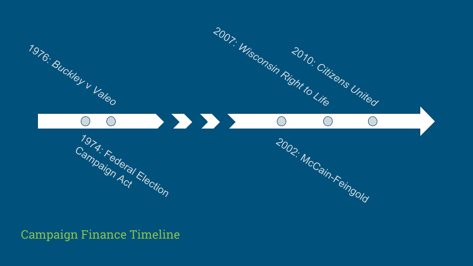
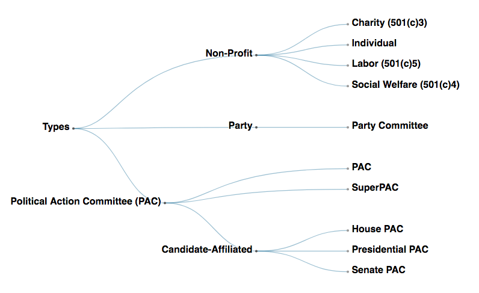
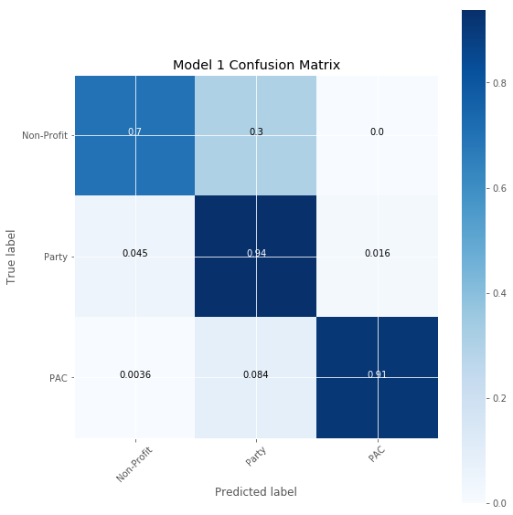
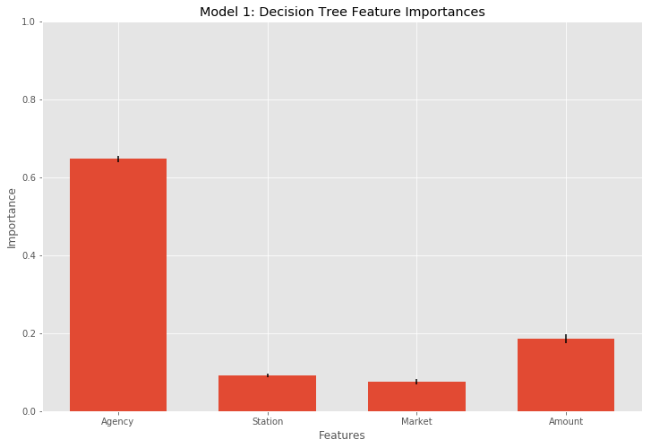

For my third project at Metis I looked at classifying types of political committees by ad contracts. Generally speaking, a political committee is an organization that spends money to influence a political race or promote a political agenda. Money in politics, refered to as campaign finance and/or spending, is a hot topic these days thanks in large part to the Supreme Court case *Citizens United* and more recently [Bernie Sanders' presidential campaign](https://go.berniesanders.com/page/content/27/). For those unfamiliar with the issue, the discussion around it centers on the implications of large amounts of money--often from a relatively few entities--being spent to sway voter opinion.  

Here's a *quick* overview:  

Political spending is protected as a form of speech by the First Amendment. However, as with other forms of protected speech, there are distinctions and grey areas. The first distinction is between direct and indirect spending. The 1974 Federal Election Campaign Act limited direct contributions to candidates--recognizing the possibility of corruption and compromise--but, significantly, said nothing about independent expenditures--indirect political spending. Two years later the Supreme Court granted freedom of speech protections to political contributions and expenditures but to differing degrees, arguing contributions should be regulated because of the possibility of corruption and compromise (*quid pro quo*), but expenditures, including independent expenditures, should receive greater protection because they are a more pure form of political speech than contributions.

The second distinction is the degree of indirect spending. In addition to the candidate campaigns, political parties and third-party organizations, referred to as political action committees (PACs), raise and spend money during elections as well. In 2002 the Bipartisan Campaign Reform (McCain-Feingold) Act sought to limit contributions to party committees. Then, in 2007, the Supreme Court case *Wisconsin Right to Life* expanded protections to PACs funded by corporations and unions, whose political spending was previously limited. Finally, *Citizens United*, which gets undeserved credit for most of this, simply connected the logical dots from *Wisconsin* to *Buckley*--if corporations and unions can contribute to PACs and contributing to PACs is protected by the First Amendment then they should also be allowed to engage in other forms of protected political spending, including direct contributions, which people can do. Hence, corporations are people.

The third distinction is whether a committee is required by law to disclose its donors. Candidate committees, party committees, and political action committees are all required to disclose donors for amounts greater than a certain amount. However, these committees can also accept donations from other organizations, such as corporations, unions, and certain types of non-profits, that do not have to disclose their donors, which provides an easy loophole for individuals or entities that wish to put money towards an election or agenda anonymously.  

Make sense? For more background check out [ProPublica's Campaign Finance Reading Guide](https://www.propublica.org/article/from-citizens-united-to-super-pacs-a-campaign-finance-reading-guide).

Here's a chart I made using d3.js to illustrate the types of committees. The code is borrowed and modified from Mike Bostock's [cluster dendogram](https://bl.ocks.org/mbostock/4063570).

<!--[MAKE HOVER ELEMENT ON DENDO TO ILLUSTRATE DISTINCTIONS]-->

So what about those ad contracts? Political committees spend large amounts of money on television ads, which in this context constitute one of the primary ways committees exercise speech. Also the distinctions I laid out above show themselves in political ads--some are paid for directly by a candidate's campaign, some are paid for by a party and generally support or attack the party line, some support or oppose a candidate but are not directly affiliated with a party or candidate, and some simply advocate for a political agenda. For these two reasons I though it would be interesting to see if there are distinct patterns in the terms of the ad contracts purchased by different types of political committees and whether that alone is enough to classify political committees. In other words, can I classify a political committee by looking only at the ad contracts it buys. 

The motivation is that because of the distinctions between committees some might be more prevalent is certain situations than others. For instance, a candidate committee, such as Bernie Sanders', that looks to raise money from many individual donors might purchase several contracts for relatively little money. Conversely, a PAC might purchase a few targeted ads contracts worth a lot more. The idea is less to examine where the money is coming from, which is a large point of discussion within this topic, and more to examine how the money is being used. 

My primary dataset for this project was ProPublica's [Free the Files Filings dataset](https://www.propublica.org/datastore/dataset/free-the-files-filing-data). In 2012 the Federal Communication Commission required all political ad contracts be made public, but it didn't specify how television stations should submit their contracts. Consequently, most of them submitted PDFs. ProPublica responded by starting Free the Files, a crowdsourced initiative where volunteers recorded data from the PDFs submitted to the FCC. The Filings dataset, which amounted to 60,000 filings, is the result of the project. The data included information such as the television station, the media market, the ad agency involved, the amount of the contract, and the name of the organization that purchased the contract, to name a few.

I supplemented that data with ProPublica's [Free the Files API](https://projects.propublica.org/free-the-files/api) to get more information about the committees and ProPublica's [Campaign Finance API](https://propublica.github.io/campaign-finance-api-docs/), which includes committee info from the Federal Election Commission (FEC), to get each committee's type. You can see my code for requesting the data from the Free the Files API [here](https://github.com/cjfranzini/committee_ad_contracts/tree/master/notebooks/00_ftf_get_committee_data.ipynb) and the Campaign Finance API [here](https://github.com/cjfranzini/committee_ad_contracts/blob/master/notebooks/01_cf_get_committee_data.ipynb).

After compiling the data I used Amazon Web Service (AWS) and PostgreSQL to join the data. You can see that notebook [here](https://github.com/cjfranzini/committee_ad_contracts/blob/master/notebooks/02_join_data_using_SQL.ipynb). I then cleaned the data to prepare it for modeling. That notebook is [here](https://github.com/cjfranzini/committee_ad_contracts/blob/master/notebooks/03_clean_data.ipynb).

To start I wanted to look only at the information available from the ad contracts, so the first model I built used the advertising agency, the television station, the media market, and the gross amount of the contract as features to classify the type of committee. For the first model I looked at three-classes: non-profit, PAC, and party committee (the FEC labels each committee in the dataset as one of these three more general types, so I wasn't reducing my data). I used a variety of classification algorithms available in the SciKit-Learn library. In general, trees and forests performed better than other types of classification, including logistic regression, K-nearest neighbors, and support vector machines. Eventually I decided on decision trees because random forests and gradient boosted trees did not significantly improve the model, so I picked the simpler model. 

The model performed reasonably well with precision, recall, and F1 scores around 0.90. The model mostly misclassified non-profits as party committees and did well on the other classes. The most surprising aspect of my model was the importance of the ad agency as a feature for classification. It is one thing that there are ad agencies that cater to political groups in general, but the model appears to suggest that agencies cater to specific types of political committees. As far as I know the role of ad agencies isn't even talked about in this context. I've certainly never heard of agencies specializing in PACs or non-profits and the implications of that. Maybe this is obvious to someone in the advertising sector but from a political science perspective it's news to me.

I then ran the model again with six of the sub-classes: house-candidate committees, senate-candidate committees, presidential-candidate committees, SuperPACs (PACs with no limitation on contribution amounts but cannot donate directly to a candidate), party committees, and individuals/non-profits. It performed slightly worse and also misclassified the PAC and individual/non-profit classes. And again, advertising agency was the most important feature.

In other models I tried adding other information about the committees, much of it from the Campaign Finance API, but those features ended up dominating the model. This is likely because they were direct manifestations of the legal discrepancies between the committees. 

The notebook for my model is [here](https://github.com/cjfranzini/committee_ad_contracts/blob/master/notebooks/04_classification_model.ipynb).

In the end, this project was more illustrative than predictive but it exposed an interesting aspect of the campaign finance discussion that I was previously unaware of. Looking ahead, I am interested in exploring the role of advertising agencies in political advertising and campaign finance more generally.

Big thanks to ProPublica for the data and all the work they do. For more info check out [http://propublica.org](http://propublica.org).